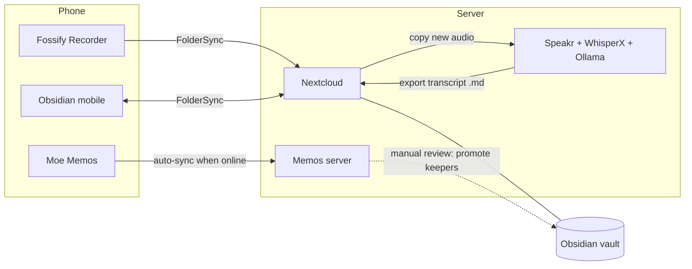

# Note flows

Documentation of my note-taking flows and the self-hosted setup behind them.

Guiding principles:

- **Self-hosted** — all data lives on my own server. No third-party cloud services.
- **Offline-first** — capture must work without internet (travel). Sync happens when connectivity returns.
- **Fast capture, deliberate processing** — getting a thought down should take seconds; organizing and refining happens later, on my terms.
- **Privacy** — audio and text never leave infrastructure I control. Transcription and LLM processing run on my own hardware.

Formats and interop (how captures enter, how routed artifacts stay traceable, how other apps feed in): [standards.md](standards.md) — part of the wider `commons` family of tools.

## The three flows

| Flow | Doc | Capture tool | Home |
|---|---|---|---|
| Fast manual notes | [flows/fast-notes.md](flows/fast-notes.md) | Moe Memos (Android) | Memos server |
| Deliberate notes & research | [flows/obsidian.md](flows/obsidian.md) | Obsidian (Android/desktop) | Obsidian vault via Nextcloud |
| Voice notes | [flows/voice-notes.md](flows/voice-notes.md) | Fossify Voice Recorder | Vault (`voice/` folder) + Speakr |

How they relate:

Longer-term, these flows might converge into a single self-hostable app — see [vision/unified-app.md](vision/unified-app.md) for the gaps such an app would fill and a critical take on whether it's worth building. [inspiration/prior-art.md](inspiration/prior-art.md) surveys what already exists (2026-07): the app's uncovered combination is confirmed, but several gaps close with existing tools. **Current stance: try the assembled flows first** — [action-plan.md](action-plan.md) — and only build if specific frictions survive. [vision/semantic-search.md](vision/semantic-search.md) covers vector embeddings for smart search and "this note belongs to project X" suggestions: Smart Connections in the vault today, an embedding index in the hub later. [vision/project-collections.md](vision/project-collections.md) records a further-out direction: projects as curated databases of heterogeneous fragments (links, quotes, palettes, boards — anything), with original captures preserved underneath the processed material.

Fast notes and the vault are deliberately **separate systems**: Memos is the timestamped stream of ephemeral thoughts, the vault is where refined, long-lived material ends up. The bridge between them is a manual review ritual, not automation (see [fast-notes.md](flows/fast-notes.md#processing-later)).
