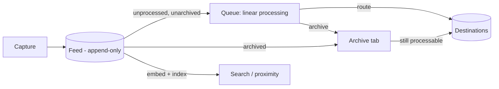

# Vision: the pool, the queue, and routing

Settled design (2026-07) for notemap's core: what the item store is, how notes are
processed, and how they leave. This is the concrete model behind the core loop sketched in
[unified-app.md](unified-app.md#the-core-loop-capture--enrich--process); it resolves two
questions that doc left open (how "processed" is marked; whether the queue must drain) and
one that [project-collections.md](project-collections.md) deferred (where collected material
lives).

The prompt for writing it down: gathering material for creative projects — fragmented
journaling, auto-fiction, evergreen fiction, moodboards — where material accumulates for
years and the eventual home may be an Obsidian vault, a single markdown file, or something
not yet built.

## The two surfaces: the queue drains, the feed accumulates

The store is a **pool** of captures, and it is read through two very different surfaces:

| | Feed | Queue |
|---|---|---|
| What it is | the immutable store, chronological, complete | a filtered view: unprocessed, unarchived |
| Job | *find* things, forever | *get things processed* |
| Success | never loses anything | drains to zero |
| Access | search, semantic proximity, browse by date | linear, one item at a time |

This split is what makes long-lived creative material compatible with inbox-zero
discipline. The queue does not need to be the retrieval surface for a fragment that will
matter in three years — the feed plus the embedding index over it
([semantic-search.md](semantic-search.md#proximity-suggestions-the-uncovered-part)) is. So
the queue is allowed to be ruthless about draining, and nothing is lost by draining it.

**The purpose of the queue is to get the note processed, not to store it.** Leaving a note
unprocessed is permitted, never encouraged.



## The feed is append-only

- **Nothing is deleted.** Processing, routing, and archiving are all non-destructive; the
  original linear feed can be inspected at any time. The one exception is an explicit
  [hard delete](#hard-delete-the-one-exception).
- **The sort key is capture time**, recorded on the device at capture and never rewritten.
  A note captured offline on a plane and synced three days later belongs at its true
  chronological position, not at the top. This is easy to get wrong, invisible until you
  travel, and unfixable afterwards.
- Captures are timestamped visibly. The timestamp is part of the record, not metadata.

### Edits are revisions, not mutations

The flow should encourage treating notes as immutable; editing is rare. When it happens, it
is **append, not overwrite**:

- A **new item** is added to the feed, linked to the one it replaces (`supersedes`, PROV
  `wasRevisionOf` — see [standards.md](../../standards.md#identity--provenance-the-cross-app-glue)).
- It carries `created` = the *original* capture time, and `updated` = the time of the edit.
- **The queue orders by `updated` when present, `created` otherwise** — while the **feed**
  always orders by `created` and never moves. Two surfaces, two orders, each right for its job
  ([ADR 10](../../adr/0010-feed-and-queue-sort-differently.md)). An edited note therefore
  resurfaces at the *newest end* of the oldest-first queue — ahead of any forward-moving
  position, never silently behind it. (This originally said "the front of the queue", which
  reads as the oldest end and means the opposite.)
- The superseded item is excluded from the queue. "Superseded" is **derived** — it is
  simply "something points at me as its predecessor" — not a stored flag.
- Enrichment re-runs against the revision: the transcript, tags, and destination guess
  attached to the old content no longer apply
  ([project-collections.md](project-collections.md#the-rule-originals-are-preserved-by-default--but-the-user-owns-the-data)).

How a revision chain is *rendered* — old version hidden, greyed out, collapsed behind the
new one — is a UI question, deliberately left open.

### The one in-place exception: the head of the feed

Fixing a typo immediately after capture is not a revision of the record; it is still
finishing the thought. **The newest item may be edited in place** while it is still
unprocessed and within a grace window.

**Settled 2026-08-02** ([ADR 11](../../adr/0011-in-place-amendment-of-the-head.md)): in place is
allowed exactly while the item is the **head** — the newest item — *and* still unprocessed.
Capturing something else seals it, and nothing else does; the configurable timeout once
proposed here was dropped as complexity that bought little. Any in-place edit invalidates
whatever enrichment already ran, which simply re-runs.

Immutability begins at the pool, not at the client: a capture core has not yet accepted may be
amended or discarded freely. An offline client that cannot know whether it still holds the head
decides locally, and the edit is demoted to a revision on arrival if it no longer does.

## State: two mutable bits

Everything else about an item is derived. This is what keeps the hub thin.

| Stored | Shape | Notes |
|---|---|---|
| `archived` | boolean + optional reason | **amended 2026-08-02:** no `cause` field. Auto-archive is deferred, so every stored archive is a user decision; if age-out later ships as the derived predicate below, `cause` becomes derived too and needs no migration |
| routing records | **append-only list** of `(destination, timestamp, pointer)` | not a boolean; an item can be routed more than once, to more than one place |

Derived, never stored:

- **unprocessed** — no routing record, not archived, not superseded
- **superseded** — a later revision points at it
- **due for auto-archive** — `unprocessed AND age > threshold`

That last one matters: **age is a predicate, not a state.** Storing it would require a
timer that mutates items, breaking the append-only property for a display concern.

## The queue: linear processing

Chronological, oldest first. This is the main flow and the one the UI should optimise for.

- **Next is the primary operation.** Advancing should be one keystroke or one gesture.
- **Skip carries no state.** Skipping means doing nothing and moving on. Processed items
  drop out of the view, so previously skipped notes end up adjacent to each other on the
  next pass — an emergent effect of filtering, not bookkeeping.
- **The cursor is configurable.** Off: every session starts at the oldest unprocessed item,
  so skipped notes cost a re-encounter (mild, honest pressure) and the queue count never
  lies. On: resume where you left off. Revisions surface ahead of the cursor either way.
- **Other sorts and filters are allowed** — by tag, type, age — but linear chronological is
  the default and the assumed flow. Filtering is for finding; the queue is for draining.
- **Scroll is next.** The atomic-items / unified-reading-surface refinement in
  [unified-app.md](unified-app.md#processing-view-atomic-items-unified-reading-surface) is
  the same surface as linear processing, not a second one: items stay separate entities,
  rendered as one continuous document.

### How "processed" is marked

This closes the question deferred in
[unified-app.md](unified-app.md#processing-view-atomic-items-unified-reading-surface). No
new mechanism is needed:

| Action | Effect |
|---|---|
| **Route** | processed — a routing record exists |
| **Archive** | processed without routing |
| **Scroll past / next** | nothing — that is a skip |

## Archive: one operation, three doors

Archiving hides a note from the queue. It never deletes anything, and the note stays in the
feed.

1. **Manual archive** — "this is noise", or "decided not to act".
2. **Delete (of an unprocessed note)** — the same operation. Since nothing is actually
   removed, there is no separate concept; the UI may present it as delete, the model
   records an archive.
3. **Auto-archive** — notes older than a configurable threshold, measured **from capture
   time**, are archived automatically. Not deleted; hidden, so a backlog the user never got
   to stops weighing on the queue.

   **Deferred 2026-08-02.** Not built for now. `action-plan.md` lists *"did you want
   auto-archive, and after how long?"* as a question the Obsidian trial should answer, so any
   threshold picked today is a guess. When it does ship it should be the **derived predicate**
   described above rather than a timer that writes: nothing is stored, the threshold becomes a
   live dial, and raising it simply returns aged items to the queue. The archive stays fully
   processable either way, which is what removes the need to ever *un*-archive.

Archived notes live in their own tab and **remain fully processable** — the archive is a
filter, not a terminus. The `cause` field distinguishes a note the user decided about from
one that merely aged out; an optional **reason** on manual archiving is cheap to record now
and impossible to backfill later.

## Classify, then route

Processing is two phases, and they cost very different amounts:

| | Classify | Route |
|---|---|---|
| Decision | what is this, whose is it | where it goes, in what form |
| Cost | seconds; bulk-able; fully reversible | needs the destination's shape in mind |
| Effect | item stays in the queue | item is delivered; queue drains |
| Enrichment's role | suggests tags | suggests destination |

Classification may happen at capture (an inline `#tag`, as in
[fast-notes.md](../flows/fast-notes.md#capture-anywhere-online-or-offline)), during a
dedicated pass, or whenever the user feels like it. A tag applied at capture is a
pre-filled suggestion, not a commitment — capture must still never *require* a decision.

Classification is also what makes a partially-drained queue survivable: an unrouted but
classified item is findable, and findable is most of what routing was buying.

## Destinations and the routing table

A **destination** is anything a note can be delivered to. An Obsidian vault is one shape; a
single markdown file is another; a future standalone collection app is a third. Routing
rules select a destination from the item's tags:

```yaml
destinations:
  fiction-a:   { adapter: obsidian-vault, path: ~/vaults/fiction-a, subdir: fragments/ }
  fiction-b:   { adapter: obsidian-vault, path: ~/vaults/main,      subdir: projects/b/ }
  commonplace: { adapter: append-file,    path: ~/vaults/main/commonplace.md }
  moodboard:   { adapter: webhook,        url: ... }

rules:
  - match: { tag: fictionidea1 } → fiction-a
  - match: { tag: fictionidea2 } → fiction-b
  - match: { tag: quote }        → commonplace
```

- **`append-file` is the honest minimum.** Everything into one markdown file, no structure,
  no linking. If routing only works against a vault it is not routing, it is a vault
  writer — that adapter is what proves the interface is real.
- **Rules propose, they do not fire.** Per the hard rule in
  [standards.md](../../standards.md#the-ingestion-contract-the-inbox), a matching rule
  pre-fills the destination and the user confirms. Auto-fire is opt-in per rule, for
  patterns that have earned trust.
- **Fan-out is legal.** Two rules match, the note goes to both places — hence routing
  records are a list.
- **Verbs differ by payload type.** Text can be *created* as a new note or *appended* into
  an existing one; an audio blob or an image can only be *placed* (a file plus a stub note,
  or a list entry). Some (destination, payload-type) pairs are simply invalid, and the
  adapter must declare which. See the payload table in
  [standards.md](../../standards.md#payload-types).

Which existing note to append to is a later concern, but the machinery already exists: the
k-NN destination suggestion in
[semantic-search.md](semantic-search.md#proximity-suggestions-the-uncovered-part) works at
note granularity as well as project granularity, with the neighbours shown as evidence.

### Routing is non-destructive and best-effort

- The note stays in the feed. Routing copies outward; it never moves or empties.
- The routing record stores a **pointer** to where the note went, tracked as well as
  possible. The destination is someone else's system and may be edited, moved, or deleted
  afterwards. **A stale pointer is acceptable** — it records where the note once went, not
  a guarantee about where it is.

### Collections are destinations

This resolves the question
[project-collections.md](project-collections.md) deliberately left open. notemap does not
own collections and does not need to know their shape. A project collection — an Obsidian
folder, an Are.na-like board, a single file — is always reached through an adapter. The
consequence is that the collection's home can change without touching the pool, which is
the whole argument for building the pool first.

## Hard delete: the one exception

Data ownership outranks preservation. If the user captured something they should not have,
they must be able to remove it — not archive it, remove it.

A hard delete purges, for the note and **its entire revision chain**:

- every revision of the item (otherwise the content survives in a superseded version — this
  is the point of the feature, and the easiest part to get wrong);
- attached assets (audio, snapshots), unless another item still references them — assets are
  path-addressed rather than content-addressed, with the content hash recorded as metadata for
  drift detection, so sharing is a reference count
  ([ADR 1](../../adr/0001-pool-is-a-database.md));
- enrichment artifacts: transcripts, suggestions, and **embedding vectors**, which are
  lossy but real traces of the text;
- all routing records referencing it.

It does **not** touch anything already delivered to a destination. If routing records exist
at delete time, the user is warned with the specifics — *"deleted here, but this note may
still exist in vault B"* — and after the purge nothing remains to warn about later.

**Amended 2026-08-02:** this section originally said *"no tombstone: that is what the user
asked for"*. That held while nothing outside the pool kept a copy. Clients now cache items
([ADR 3](../../adr/0003-clients-hold-an-outbox-pools-do-not-replicate.md)) and delta sync reports
changes since a cursor, so a deleted row produces no change and a cached copy would survive
forever — defeating the feature. A purge therefore retains `(id, purged_at)` and nothing else,
garbage-collected after a retention window. See
[ADR 4](../../adr/0004-purge-leaves-a-minimal-tombstone.md).

## What notemap owns, and what it does not

Because items never merge with each other and the store is append-only, the hub is small.
It owns exactly four things:

1. the **feed** — immutable, chronological, complete;
2. **classification** — tags, and only tags. *Amended 2026-08-02:* there is no item type and no
   project entity. "Type" in the sense of idea/bookmark/todo is a tag; a project is a tag that
   routing rules match on, since collections are destinations. **Payload type** — text, voice,
   link — is mechanical, derived from what arrived, and is not classification;
3. **enrichment** — advisory only, regenerable, never applied
   ([standards.md](../../standards.md#the-ingestion-contract-the-inbox));
4. the **routing log** — append-only, best-effort pointers.

It does not own collections, prose, arrangement, composition, or any editor. There is no
item-to-item merging, so no conflict resolution and no CRDT. This is a considerably more
defensible version of the *"thin hub, not a monolith"* verdict in
[unified-app.md](unified-app.md#the-genuine-gaps-my-critical-take).

## Deliberately open

- ~~**Grace-window semantics** for in-place editing the head of the feed.~~ **Settled
  2026-08-02** — head *and* unprocessed, no timeout
  ([ADR 11](../../adr/0011-in-place-amendment-of-the-head.md)).
- **Rendering of revision chains** in the feed and queue.
- **Processing position** — whether it is a persisted cursor or simply scroll position in a
  continuous document. Core holds neither
  ([ADR 10](../../adr/0010-feed-and-queue-sort-differently.md)); this is a frontend question.
- **Multiple inboxes** — choosing a target pool at capture time. A future concern; one pool
  per user for now.
- **Merge granularity** — appending into an existing note, and how (or whether) the pointer
  survives editing on the destination side. Obsidian block IDs (`^cap-<id>`) would make the
  back-pointer survive ordinary editing at no cost, but a broken pointer is already
  acceptable, so this is a nicety rather than a requirement.
- **Arrangement** of routed material — boards, canvases, ordering. Belongs to the
  destination, not to notemap.
