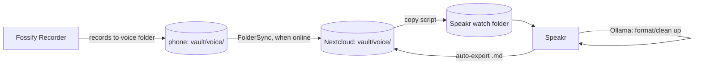

# Voice notes

Record a voice memo on the phone; end up with a formatted, timestamped transcript note **beside the audio file in the Obsidian vault** — transcribed and post-processed entirely on my own server, with a web UI for correcting transcription mistakes against the audio.

## Why this flow

- Speaking is faster than typing for longer thoughts, especially while walking/traveling.
- **Privacy:** audio never leaves my infrastructure. Transcription (WhisperX) and formatting (Ollama) are self-hosted.
- The transcript must keep **timestamps** tied to the original audio, so mis-transcribed passages can be found and fixed by listening.
- The vault is the archive: audio + transcript live together in `voice/`, playable/readable in Obsidian.

## The flow



### Capture (offline-friendly)

1. Record with **Fossify Voice Recorder**; recordings save into the vault's `voice/` folder on the phone.
2. Nothing else to do. Offline, recordings simply queue up locally; FolderSync uploads them at the next sync on Wi-Fi.

### Processing (automatic, on the server)

3. A small server-side script watches the vault's `voice/` folder (server side, i.e. the Nextcloud copy) and **copies** each new audio file into Speakr's watched "black hole" folder. (Copy, not move — the black hole consumes its input, and the original must stay in the vault. Audio is intentionally stored twice: vault = archive, Speakr = working copy.)
4. Speakr auto-imports and transcribes with **WhisperX** — word-level timestamps, automatic language detection.
5. Speakr's summary/formatting step runs a custom prompt against **Ollama**: clean up filler words, add paragraphs and headings, keep the content faithful (formatting, not summarizing — that's the prompt's job to enforce).
6. Speakr's **automatic export** writes a templated markdown file into `vault/voice/`, named to match the audio file. FolderSync/Nextcloud propagate it everywhere. Result in the vault:

   ```
   voice/
     2026-07-21_14-32.m4a
     2026-07-21_14-32.md   ← formatted text + timestamped transcript + embed of the audio
   ```

### Review & correction (when I get to it)

7. Open the recording in **Speakr's web UI**: transcript beside the audio player, click any line to jump to that moment, follow-along highlighting. Fix mis-transcriptions in place.
8. Re-export (or let auto-export update the file) so the corrected version lands in the vault.
9. In Obsidian, the note stands alone: the export template embeds the audio (`![[2026-07-21_14-32.m4a]]`), so casual playback + reading works in the vault too; Speakr is only needed for serious correction sessions.

## Suggested setup

| Component | Choice | Notes |
|---|---|---|
| Recorder | Fossify Voice Recorder (F-Droid) | Confirmed: records straight into the vault's `voice/` folder, already covered by the existing FolderSync pair. |
| Phone→server | FolderSync (existing) | `voice/` must be inside the synced set — see [obsidian.md](obsidian.md). |
| Transcription app | [Speakr](https://github.com/murtaza-nasir/speakr) (Docker) | Watched folder intake, synced correction editor, templated auto-export. |
| ASR backend | WhisperX (self-hosted, Speakr's recommended connector) | Word-level timestamps; CPU is fine for voice-memo lengths, GPU optional. |
| Formatting LLM | Ollama + small model (~8B, e.g. Llama 3.1 or Qwen 3) | Via Speakr's OpenAI-compatible backend setting. Reformatting needs no big model. |
| Glue | Copy script: server `voice/` → Speakr watch folder | inotify or cron+rsync; idempotent (track already-copied files). |

### Export template (sketch)

Speakr's export template should produce roughly:

```markdown
---
date: {{ recorded_at }}
source: voice
tags: [voice-note]
---
![[{{ audio_filename }}]]

## Notes
{{ llm_formatted_text }}

## Transcript
{{ transcript_with_timestamps }}
```

Both sections on purpose: the formatted version for reading, the raw timestamped transcript as ground truth for finding and fixing errors.

### Decisions made

- **Audio home:** vault is the archive; Speakr holds a duplicate working copy. Accepted cost: double storage. Optional later: prune Speakr recordings after correction is finalized.
- **Speakr over Scriberr:** Scriberr has no file export (transcripts live only in its own DB/UI) and its development is currently paused; Speakr's vault auto-export is a first-class feature.

### Open items (before building)

- [ ] Choose Speakr auto-export filename pattern so `.md` matches the audio basename.
- [ ] Write and test the copy script (idempotency; partial-upload handling — only copy files FolderSync has finished writing).
- [ ] Write the Ollama formatting prompt; test on a rambling real-world memo.
- [ ] Decide Speakr retention policy (keep everything vs. prune after review).
