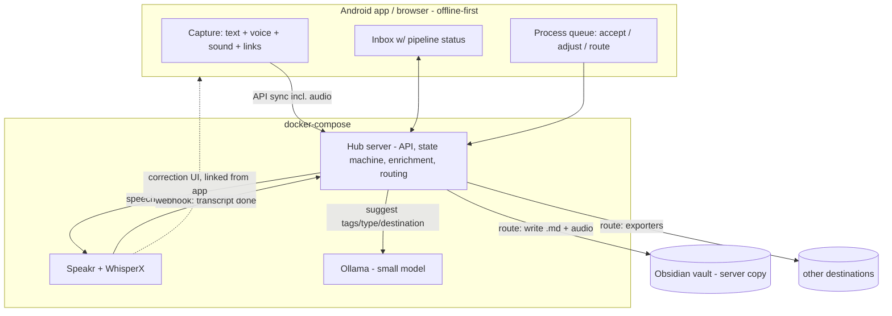

# Vision: one app for the whole flow

Notes on a possible self-hostable app that covers everything in [the three flows](../README.md) as one product: one server (bespoke docker-compose), one Android app, Obsidian as the archive. Existing projects (Speakr, WhisperX, Ollama) stay as components; the app is the layer on top.

## The vision in one paragraph

Capture **anything** I deem potentially important — a jotted idea, a movie to watch, a thought, a few spoken words, a recording of birdsong — into one offline-first, timestamped inbox on the phone. When online, everything syncs to my server, where captures are **automatically enriched but never altered**: transcription for speech, suggested tags, LLM guesses about what a note is and where it belongs — all stored as *suggestions beside* the capture, no file moved or edited. Then, once a day or twice a week, I sit down (phone or browser) and **process the queue**: item by item, accept or adjust the suggestions, and route each capture to where it lives — managed by the app itself, filed into the Obsidian vault, or handed to any other knowledge platform. Corrections of transcripts happen in Speakr, linked. Nothing requires a third-party service, and all AI runs on an old laptop.

**This is not second-brain software** — those exist in abundance, and the vault already is one. This is a *note-taking and note-processing flow*: capture and triage. The app is a conveyor belt with an inbox at one end and other people's archives at the other; items are supposed to *leave* it.

## The core loop: capture → enrich → process

1. **Capture** — universal and instant. Text, voice, sound, links; anything. No decisions at capture time beyond optional tags. This is why capture must be its own surface and not a vault editor: filing is precisely what capture must never ask for.
2. **Enrich** (automatic, server-side, advisory only) — transcription when the audio is speech (and recognizing when it isn't — birdsong shouldn't come back as garbled text), suggested tags, a suggested title, a guessed type (idea / bookmark / todo / sound / reference) and destination. Hard rule: **enrichment produces suggestions attached to the item, never mutations.** Nothing is moved, renamed, or rewritten until I say so.
3. **Process** (manual, batched) — the review queue, done daily-ish, on phone or in browser. Each item is one decision: accept the suggestions or adjust them, then route — into the app's own storage, into the vault, into another platform, or to the archive/trash. The queue drains to zero; that's the ritual. GTD's inbox-processing discipline, applied to multimodal captures instead of email.

## What exists vs. what's missing

| Requirement | Covered today by | Gap |
|---|---|---|
| Fast offline text capture, timeline, tags | Memos + Moe Memos | — |
| Voice recording on phone | Fossify | — (but it's a separate app, separate sync) |
| Transcription + timestamps + correction UI | Speakr + WhisperX | — |
| LLM formatting | Speakr + Ollama | — |
| Transcript file into vault | Speakr auto-export | — |
| **One capture app for text + voice** | nothing | Three apps, three muscle memories |
| **One sync mechanism** | nothing | API sync (Moe Memos) + file sync (FolderSync) + export paths; file sync is the fragile one |
| **Pipeline visibility on the phone** | nothing | Today: record and *hope*; no way to see from the phone that a memo got transcribed |
| **Review/promotion workflow** | nothing | The "process later" ritual has no tool: no tracking of what's been reviewed, no promote-to-vault action from the timeline |
| **Vault write from review** | nothing | Promoting a text note to Obsidian is manual copy-paste |

## The genuine gaps (my critical take)

Being honest about wheel-reinvention:

- **Rebuilding capture, transcription, or the correction editor is reinventing the wheel.** Memos, Speakr, and WhisperX each do their piece well. A from-scratch monolith would spend years reaching their maturity and then need solo maintenance forever (cautionary tale: Scriberr paused when its one maintainer got laid off).
- **The orchestration layer is genuinely uncovered ground.** Nobody has built the *bridge*: a unified offline-first capture inbox whose items carry **lifecycle state** (captured → synced → enriched → queued → processed → routed), with pluggable destinations (app storage, Obsidian vault, other platforms). Memos has no queue or vault concept; Speakr has no text notes and no review state; Obsidian has no inbox pipeline. The email world solved triage decades ago (inbox zero, snooze, one-decision-per-item); no note tool applies that discipline to multimodal captures.
- **The suggestion layer, done right, is also novel.** Plenty of apps bolt on AI that *does things to* your notes. The advisory-only model — AI pre-chews (transcript, tags, type, destination guess) and a human ratifies during queue processing — is rare, and it's what makes small local models viable: a 3–4B model that's wrong 20% of the time is unacceptable as an actor but perfectly useful as a suggester whose output you're already reviewing anyway.
- **The second real gap is sync unification.** The fragile part of the current stack is file-level two-way sync as a *transport for capture*. An app with its own API sync (like Moe Memos' offline-first model, but also carrying audio blobs) removes FolderSync from the capture path entirely — only the *server* touches vault files, one writer, no two-way file sync races. FolderSync then only needs to mirror the vault down to the phone for reading, which is the easy direction.
- **The third, smaller gap: pipeline status on the phone.** Trivial feature, no existing combination provides it.

Verdict: **not reinventing the wheel, provided the app is a thin hub, not a monolith.** The moment it grows its own transcription engine or its own full editor, it's rebuilding Speakr. The defensible product is: capture client + state machine + vault writer + integrations.

## Sketch

- **Hub server** (the only truly new backend code): item store, sync API, lifecycle state machine, enrichment orchestration (Speakr API/webhook client, Ollama client — output stored as suggestions on the item, never applied), and pluggable **routers**: vault writer first (plain filesystem writes into the Nextcloud-served vault dir; Obsidian-compatible markdown + `![[audio]]` embeds), generic webhook/exporter interface for other platforms later.
- **Android app** (the expensive part): local-first store, capture UX with Memos-like speed, share-target so *any* recorder app can feed it, background sync. Could start as a PWA (Speakr and Memos both prove the pattern) — but true offline capture + reliable background sync on Android realistically wants a native (or Tauri/Capacitor) app eventually.
- **Speakr integration**: hub submits audio via Speakr's REST API, listens to its signed webhooks, pulls the corrected transcript on export. Correction stays in Speakr's UI.

## Constraints (hard requirements)

- **All AI self-hosted and lightweight** — must run on the homelab: an old ASUS laptop with an **RTX 2060 (6 GB VRAM)**, shared with Nextcloud, Vaultwarden, Karakeep, etc.
  - The pipeline is bursty and **sequential** (transcribe → then format), so the two models never need to be resident at once; the GPU sits idle between memos and none of the other services use it.
  - WhisperX with `medium` int8 (~2–2.5 GB VRAM, seconds per memo on GPU; `small` as fallback). Skip diarization for now (voice memos are single-speaker).
  - Ollama with a **3–4B quantized model** (e.g. Llama 3.2 3B, Qwen 3 4B, ~3 GB) — enough for cleanup/formatting, which is the only LLM job; up to 8B Q4 fits if loaded alone. Set a short `keep_alive` so VRAM frees between jobs. One Ollama instance can also serve Karakeep's AI tagging.
  - Everything batch/async: capture must never wait on AI.
- **Vault is plain files** — the app writes standard markdown; if the app dies, the archive is untouched and every capture is exportable. No lock-in, ever.
- **Degrade gracefully offline**: capture always works; AI steps queue.

## Path (avoid building the monolith on day one)

1. **Phase 0 — glue scripts** (already planned): FolderSync + copy script + Speakr auto-export. Proves the pipeline; no new apps.
2. **Phase 1 — hub server + web queue UI**: state machine over existing captures (read Memos API + watch `voice/`), enrichment suggestions, and the browser-based process-the-queue view with accept/adjust/route actions (vault router first). Ship as one docker-compose bundling hub + Speakr + Ollama. *Most of the gap value lives here, with zero mobile development — and it tests the daily/twice-weekly ritual itself, which is the riskiest assumption.*
3. **Phase 2 — capture app**: only if Phase 1 proves the ritual works and the three-app capture friction still hurts. Start as PWA + Android share-target; go native only if offline/background sync demands it.

*(More detailed notes on this vision to be added — see future additions to this folder.)*
